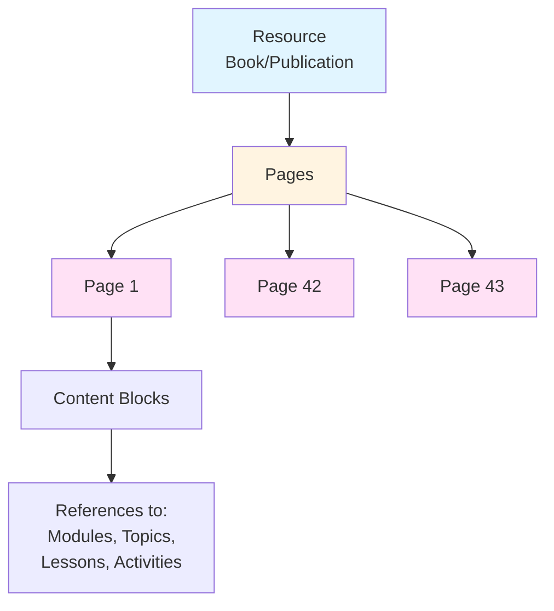
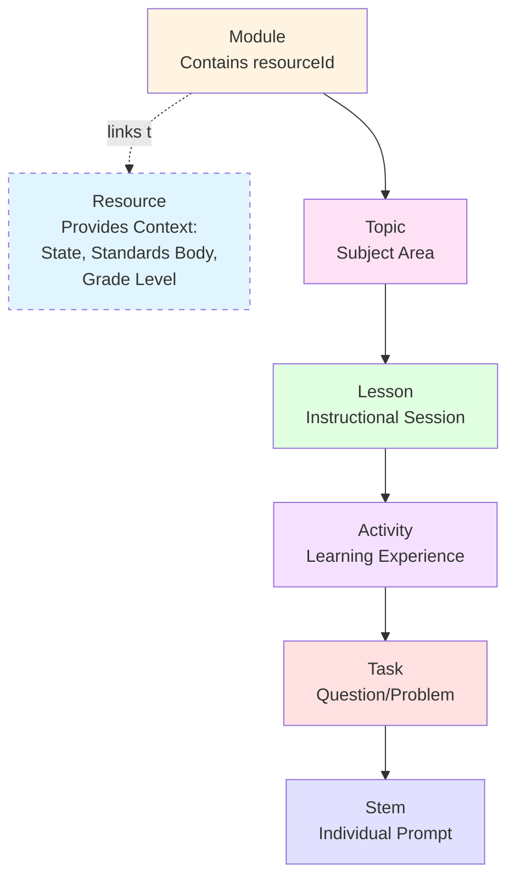
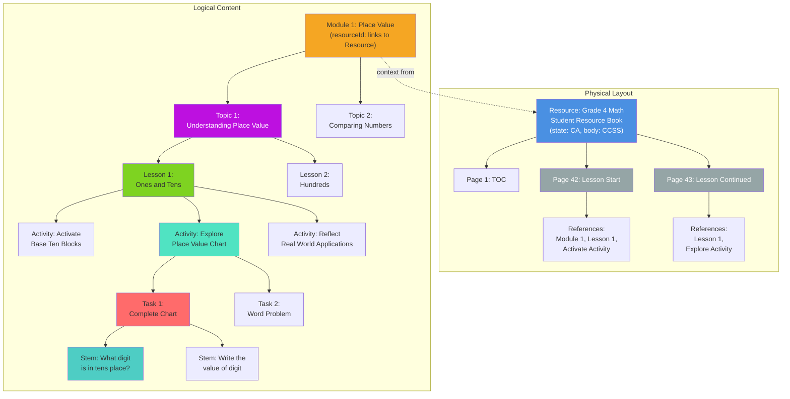
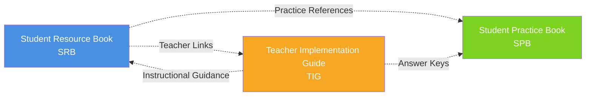
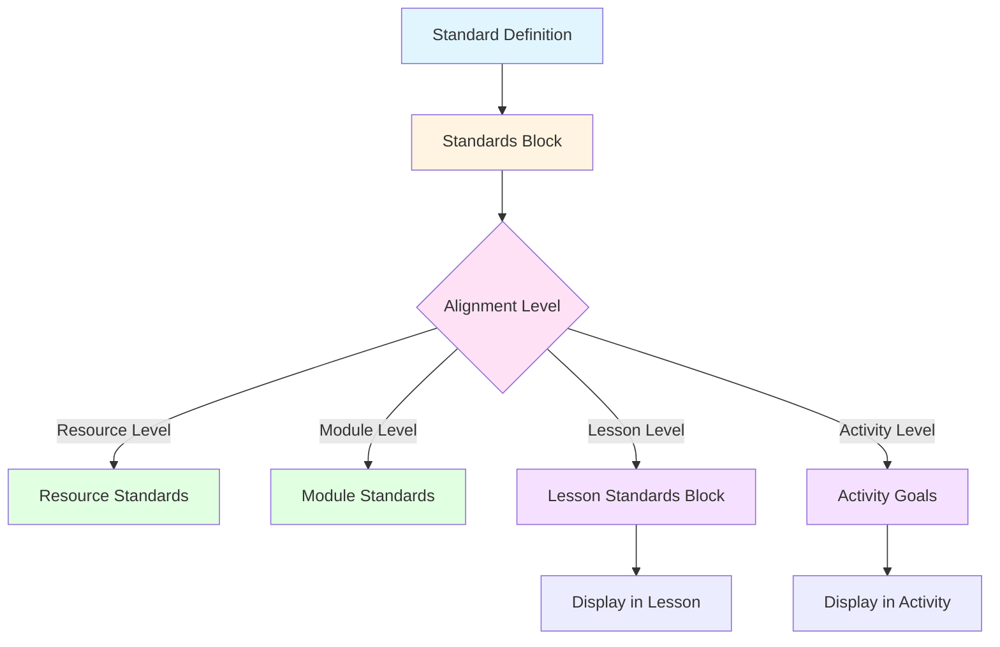
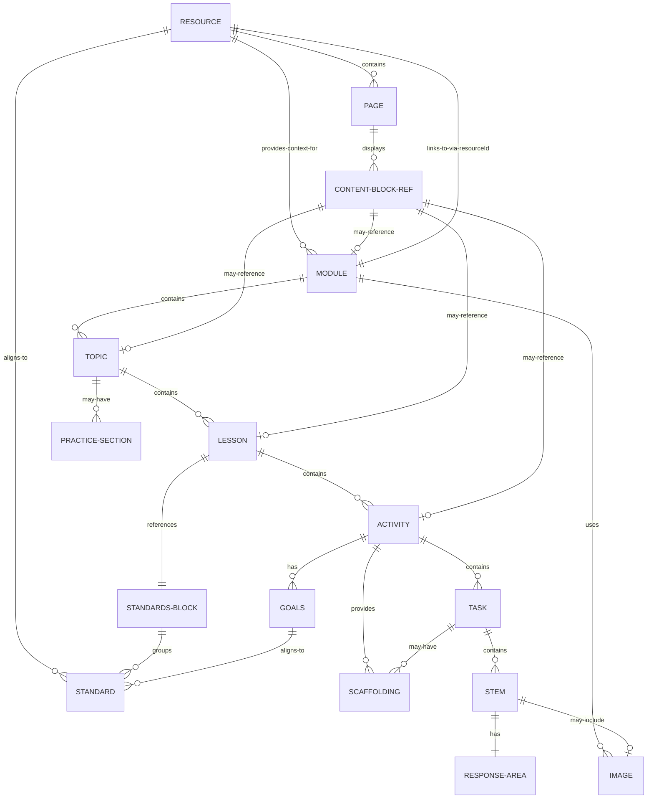
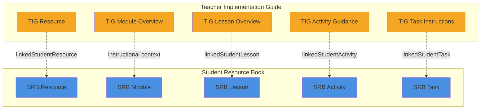
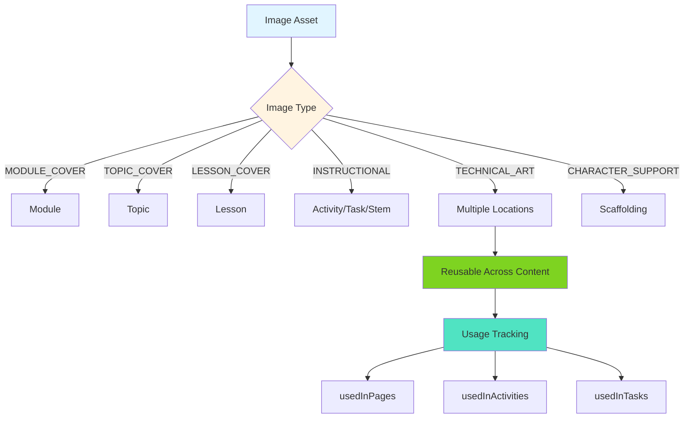
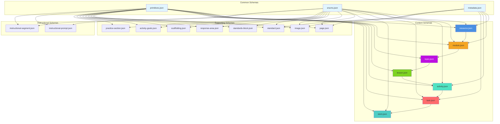

# System Architecture

## Table of Contents

1. [Overview](#overview)
2. [Content Hierarchy](#content-hierarchy)
3. [Resource Types](#resource-types)
4. [Data Flow](#data-flow)
5. [Relationship Diagrams](#relationship-diagrams)
6. [Schema Dependencies](#schema-dependencies)
7. [Design Principles](#design-principles)

## Overview

The JSON schema is designed as a hierarchical, relational data model that supports three distinct publication types while maintaining content coherence and reusability. The architecture balances flexibility with structure, enabling both rigid curriculum organization and dynamic content relationships.

### Core Architectural Principles

1. **Separation of Concerns**: Physical layout (pages) is separate from logical content organization (modules/lessons)
2. **Hierarchical Organization**: Clear parent-child relationships from Resource down to Stem
3. **Content Reusability**: Images and other assets can be shared across content
4. **Standards Alignment**: Multiple levels of standards integration
5. **Explicit Linking**: Teacher content explicitly links to student content
6. **Localization Support**: Built-in internationalization and state-specific variations

## Content Hierarchy

> **Note**: You can view and interact with the Mermaid diagrams in this document by pasting them into [Mermaid Chart Playground](https://www.mermaidchart.com/play).

The system employs two parallel hierarchies that work together:

### Physical Layout Hierarchy

Pages provide the physical structure of how content appears in books:



### Logical Content Hierarchy

Content is organized hierarchically starting from Modules, which link to Resources for context:



**Key Points**:
- Modules have a `resourceId` field linking them to their parent Resource
- This link provides context (state, standards body, grade level, edition)
- Content hierarchy starts at Module level for logical organization
- Pages reference content blocks at any level for physical layout
- This separation allows flexible page layouts while maintaining clear content structure

### Complete System Example

This shows how both hierarchies work together:



## Resource Types

### Understanding the Dual Hierarchy

The system uses two complementary hierarchies:

**1. Physical Layout (Resource → Pages)**
- Describes how content appears in the physical/digital book
- Pages reference content blocks for display
- Handles page numbers, page types, layout
- Example: "Page 42 shows Module 1 introduction and Lesson 1 Activate activity"

**2. Logical Content (Module → ... → Stem)**
- Describes the pedagogical organization of content
- Modules link to Resources (via `resourceId`) for context
- Independent of physical page layout
- Example: "Module 1 contains 3 topics, Topic 1 has 5 lessons"

**Why Modules Link to Resources:**
- Provides state context (e.g., CA, TX, FL)
- Defines standards body (CCSS, TEKS, BEST, CA_CCSS)
- Specifies grade level and edition
- Enables multi-state publishing from same content
- Allows resource-level metadata to inform content

**Example:**
```json
{
  "module": {
    "id": "module-1-uuid",
    "resourceId": "resource-ca-grade4-uuid",  // Links to CA Grade 4 Resource
    "moduleNumber": 1,
    "title": "Place Value"
  }
}
```

The Resource provides context:
```json
{
  "resource": {
    "id": "resource-ca-grade4-uuid",
    "gradeLevel": "4",
    "state": "CA",
    "standardsBody": "CA_CCSS"
  }
}
```

### Three Book Architecture



### Resource Type Characteristics

| Feature | Student Resource Book | Student Practice Book | Teacher Implementation Guide |
|---------|----------------------|----------------------|----------------------------|
| **Primary Audience** | Students | Students | Teachers |
| **Content Type** | Instruction & Learning | Practice & Reinforcement | Teaching Strategies |
| **Activities** | Activate, Explore, Reflect | Practice Questions, Games | Instructional Segments |
| **Page Types** | Lesson content, summaries | Practice pages, family guides | Lesson overviews, guidance |
| **Linking** | Referenced by TIG | Referenced by TIG | Links to SRB and SPB |

## Data Flow

### Standards Alignment Flow



## Relationship Diagrams

### Core Entity Relationships

This diagram shows both hierarchies:



### Teacher-Student Content Linking



### Image and Media Flow



## Schema Dependencies

### Schema Dependency Graph



### Import Resolution Order

1. **Level 1 (Foundation)**
   - `primitives.json` - Basic types
   - `enums.json` - Enumerated values

2. **Level 2 (Common)**
   - `metadata.json` - Metadata structures (depends on enums, primitives)

3. **Level 3 (Supporting)**
   - `standard.json`
   - `image.json`
   - `response-area.json`
   - `scaffolding.json`

4. **Level 4 (Composite)**
   - `standards-block.json` (depends on standard)
   - `activity-goals.json` (depends on standard)

5. **Level 5 (Content)**
   - `stem.json` (depends on response-area, image)
   - `task.json` (depends on stem, scaffolding)
   - `activity.json` (depends on task, activity-goals, scaffolding)
   - `lesson.json` (depends on activity, standards-block)
   - `topic.json` (depends on lesson)
   - `module.json` (depends on topic)
   - `resource.json` (depends on module, page, standard)

6. **Level 6 (Layout & Instructional)**
   - `page.json`
   - `practice-section.json`
   - `instructional-prompt.json`
   - `instructional-segment.json`

## Design Principles

### 1. Single Responsibility

Each schema represents a single, well-defined concept:
- **Resource**: Book-level properties only
- **Lesson**: Lesson-specific content
- **Activity**: Individual learning experience
- Each entity has clear boundaries and responsibilities

### 2. Composition Over Inheritance

Content is built through composition:
- Resources contain references to modules
- Modules contain references to topics
- Activities contain references to tasks
- Enables flexible recombination

### 3. Explicit Relationships

All relationships are explicit through UUID references:
- Parent-child: `parentId` fields
- Cross-references: Reference objects with `id` and `type`
- Teacher-student: `TeacherStudentLink` objects
- No implicit relationships or conventions

### 4. Metadata Separation

Metadata is separated into reusable structures:
- Publishing metadata
- Localization info
- Copyright info
- Accessibility info
- Prevents duplication across schemas

### 5. Extensibility

The system supports extension:
- Enum values can be added for new types
- Metadata objects are flexible
- Image types are extensible
- Standards bodies can be added

### 6. Validation at Every Level

Each schema includes:
- Required fields
- Type constraints
- Pattern validation (UUIDs, dates)
- Conditional requirements
- Ensures data integrity

### 7. Localization First

Built-in support for multiple languages and locales:
- Language and locale fields in metadata
- Cultural adaptation tracking
- Translation status management
- State-specific variations

### 8. Accessibility by Design

Accessibility is integrated:
- Alt text required for images
- Long descriptions for complex visuals
- Accessibility info structures
- Screen reader compatibility flags

zw